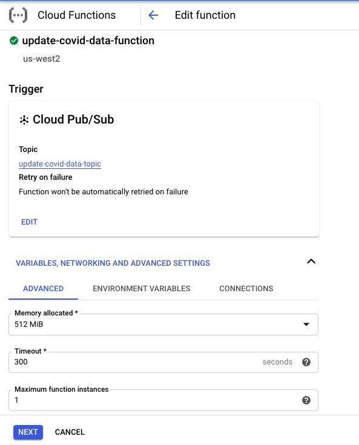

# README

<b>By:</b> Dan Ovadia 
<b>Date:</b> September 3, 2020
## Google Cloud Platform (GCP) Components

This read me will explain how the Google Cloud Platform components work to support the Heroku App hosting the covid dashboard. 

### 1. Google Cloud Storage (GCS)

A GCS bucket was created to host `covid_counties.csv.gz`, `covid_states.csv.gz`, and `states_population.csv`. The files were retrieved from multiple data sources, loaded into pandas, transformed. Then created a buffer via BytesIO and compressed using gZip loaded to the bucket using the `google-cloud-storage` python library. 

### 2. Google Cloud Function (CGF)

To automate the data processing and loading to the Cloud Storage bucket, a cloud function was created specifically to do the following:

- Retrieve required data from datasources:
    - [New York Times github](https://github.com/nytimes/covid-19-data) (for county data)
    - [The Atlantic's Covid Tracking Project](https://covidtracking.com/data/api/) (for state data)
    - [Census.gov](https://www.census.gov/data/datasets/time-series/demo/popest/2010s-counties-total.html#par_textimage_70769902) (for county population data)
- Process the data in pandas to clean and create fields for the dashboard.
- Transform the dataframes to BytesIO objects, compress using gzip. 
- Load the gzipped buffer to the Cloud Storage Bucket.

### 3. Google Pub/Sub

A Pub/Sub topic was created specifically for the Cloud Function to receive triggers from the Cloud Scheduler. The Cloud Function is subscribed to the Pub/Sub topic as it's trigger. 

### 4. Google Cloud Scheduler

A cron job was created in Cloud Scheduler to write to the Pub/Sub topic and subsequently run the Cloud Function, which updates our Google Cloud Storage buckets.

---
## Creating the Cloud Function
In order to create the Cloud Function, a couple pieces are required:
1. A python script, likely named `main.py` which runs the processes in the cloud.
2. A `requirements.txt` file which represents the python libraries needed to be imported to support the python script.
3. Any other dependences such as custom modules.

A Cloud Function represents a virtual machine that is built off a list of requirements and executes lines of code in a serverless environment. This means while you can have objects in memory, there is no local disk to write to for temporary file handling.

### Script

At the heart of the cloud function was this `main()` function. Here we essentially read data and write to the cloud. This is handled by three core functions: `generate_covid_state_data()`, `generate_covid_county_data()`, and `write_df_to_GCS(df, blob_name)`.

<pre><code>def main(event, context):
    # State Data - Setting Variables
    BUCKET_NAME = "us_covid_hotspot-bucket"
    BLOB_NAME = "covid_states.csv.gz"
    
    # Read and transform state data from Covid Tracking Project
    DF = generate_covid_state_data()
    
    # Write to Bucket - state
    print(f"Writing {BLOB_NAME} to GCS {BUCKET_NAME}")
    write_df_to_GCS(COVID_STATES_DF, BLOB_NAME)
    
    
    # County Data - Setting Variables
    BLOB_NAME = "covid_counties.csv.gz"

    # Read and transform county data from New York Times
    DF = generate_covid_county_data()
    
    # Write file to GCS
    print(f"Writing {BLOB_NAME} to GCS {BUCKET_NAME}")
    write_df_to_GCS(COVID_COUNTIES_DF, BLOB_NAME)</code></pre>

While these functions do rely on other defined functions, these are the backbone of the process. Essentially they are two read functions and one write function.

Function operations:
- <b>Read functions:</b> `generate_covid_state_data()` and `generate_covid_county_data()`
    - pull in covid <b>state</b> and <b>county</b> data
    - do a handful of transformations
    - merge in population data
    - calculate moving averages and density ratios
    - return a pandas dataframe
- <b>Write function:</b> `write_df_to_GCS(df, blob_name)`
    - take a dataframe and blob_name
    - create a BytesIO buffer to hold the compressed dataframe
    - create a GzipFile wrapped in a TextIOWrapper, and write the dataframe to the BytesIO buffer through the GzipFile.
    - set the buffer to the beginning
    - open a connection to storage
    - retrieve the bucket and blob_name provided
    - upload the BytesIO buffer holding the original dataframe

### Uploading to Cloud Functions

You could deploy a cloud function using the google cloud SDK through `gcloud` commands. Or you can also do it through the Google Cloud Console at [console.cloud.google.com/](console.cloud.google.com/). Below demonstrates the steps to upload from the browser in console.

#### Step 1 - Set the trigger and define parameters
Here we are using a Pub/Sub topic as our trigger. We will later define a cron job through Cloud Scheduler to write to the topic and trigger this function to run every morning at 4AM.

<kbd>
  
</kbd>

#### Step 2 - Provide the code base for your function

Here we select the runtime we choose to use and provide the code base for the function. Essentially `requirements.txt` and `main.py`. The only requirement was that the main function needed to take in two parameters, `event` and `context`. I believe this is due to how Pub/Sub topic work and could be very useful in particular situations.

<kbd>
  
</kbd>

### Requirements.txt
In order to accurately generate the `requirements.txt` file, it is common practice to create a fresh virtual python environment and import specific dependencies for your scripts. This is easily done using either venv, ([like this](https://docs.python.org/3/library/venv.html)) or conda, ([like this](https://uoa-eresearch.github.io/eresearch-cookbook/recipe/2014/11/20/conda/)). 

Test run the code in the virtual environment to make sure that all requirements have been satisfied. This is also a good time to check to make sure that your code does not have any other dependencies such as local data, or other local module references.

Next, we generate the `requirements.txt` file. To export a list of installed packages and respective versions, run the following in terminal while in the project directory: 
<pre><code>pip freeze > requirements.txt</code></pre>
In this code, `pip freeze` generates a list with `package`==`version` for all dependencies in your virtual environment.

#### In Practice
I ran into some trouble while trying to create the requirements.txt file. I am more comfortable using `pip` and `venv` than I am using `conda`. Below are some of the issues I ran into:

1. I had some version differences between installations using pip and installations using conda. For example, `google-cloud-storage` was installed as `v 1.28.0` using conda, while pip installed `v 1.31.0` the most recent version. At the time of this writing `v 1.31.0` had only been out for less than a week, so it's only fair. 

2. I had issues producing a viable `requirements.txt` file. I tried using both pip and conda. 

    <b>Using pip:</b> <pre><code>pip freeze > requirements.txt</code></pre> 

    failed to return version numbers for conda installed packages, specifically returning `package==@file:////[some-path]`. 
    
    <b>Using Conda:</b> <pre><code>conda list --export > requirements.txt</code></pre>
    
    returned a file completely in the wrong format, specifically `package=version=build=channel`, instead of `package==version` as GCF was expecting.

In the end, I created a virtual python environment using `venv` and `pip installed` required packages and the whole process was seemless.  It was a lot more intuitive for me and has always just worked seemlessly. Although for more information on the differences between conda and pip, a post by Jake VanderPlas, [Conda: Myths and Misconceptions](https://jakevdp.github.io/blog/2016/08/25/conda-myths-and-misconceptions/) gives a lot of good context.

---
## Conclusion
In conclusion, this process was actually incredibly easy. During the process I realized that App Engine automatically creates a bucket in Cloud Storage associated to the App. If I had hosted the web application on GCP from the start I likely could have leveraged that functionality, instead of creating a separate GCS bucket dedicated to hosting covid data.

Kudos to Wallace Wong for writing a linkedIn post that helped guide me. 

[Scheduling Python scripts on GCP using Cloud Functions and Scheduler](https://www.linkedin.com/pulse/scheduling-python-scripts-gcp-using-cloud-functions-scheduler-wong/?trackingId=DmoCY%2FbITJygLGkQ0t6EqA%3D%3D) - By Wallace Wong, Nov 19, 2019
